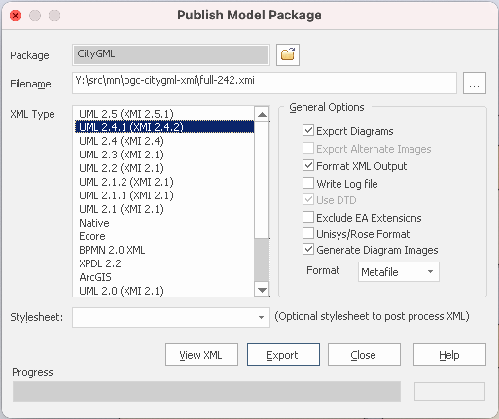

= OGC Testbed 17: OGC CityGML 3.0 as Metanorma model-based standard

image:https://github.com/metanorma/ogc-citygml-xmi/workflows/generate/badge.svg["Build Status", link="https://github.com/metanorma/ogc-citygml-xmi/actions?query=workflow%3Agenerate"]
image:https://github.com/metanorma/ogc-citygml-xmi/workflows/docker/badge.svg["Docker Build Status", link="https://github.com/metanorma/ogc-citygml-xmi/actions?query=workflow%3Adocker"]

//These documents are available in its rendered forms here:
//
//* https://metanorma.github.io/ogc-citygml-xmi/[OGC Publications in Metanorma (HTML)]

== General

This repository contains the deliverable of OGC Testbed 17 task D144
for the CityGML 3.0 model-based standard.

== Structure

`sources/`::
document source of the CityGML 3.0 standard

`xmi-full/`::
the full XMI exported from Enterprise Architect of the CityGML 3.0 EA file.

`site/`::
(automatically generated, in the `gh-pages` branch) published document.

== Usage

This repository uses `metanorma` to run these processes.

== Running via Docker or locally

If you have installed the build tools locally, and wish to run the
locally-installed compilation tools, there is nothing further to set.

If you don't want to deal with local dependencies, use the docker:

[source,sh]
----
docker run -v "$(pwd)":/metanorma -w /metanorma -it metanorma/mn metanorma site generate
----

== Building The Document

[source,sh]
----
metanorma site generate
----

== Exporting the CityGML EA model to XMI with diagrams

. Open the `CityGML_3.0_Consolidated_Draft.eap` file in Enterprise Architect
(https://github.com/opengeospatial/CityGML-3.0CM/blob/master/Conceptual%20Model/CityGML_3.0_Consolidated_Draft.eap[source])

. Select the "`CityGML`" package *only*. The `CityGML_3.0_Consolidated_Draft.eap`
file actually contains all packages from the full ISO/TC 211 Harmonized Model,
we don't need that bloat in size.

. Click on the "`Publish`" tab on the ribbon bar

. Click on "`Export-XML`", then select "`Export XML for Current Package...`"

. Click on the "`Publish`" button next to "`Other Formats:`"

. Select the "`UML 2.4.1 (XMI 2.4.2)`" XML Type if not already selected.
  Ensure that only these options are ticked:
** Export Diagrams
** Format XML Output
** Generate Diagram Images (select the "`Metafile`" Format for vector images)

. Your options should look like this ("`Stylesheet:`" must be empty): +
+

. Click "`Export`"

. Voila!

== License

These documents are privately shared by OGC and the copyright of such
documents (as well as their converted text) remain unchanged.

All other code and information, copyright Ribose.
